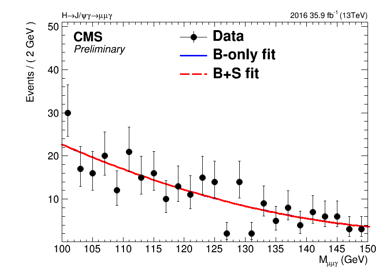

# Sideband-Fit Study #

During the review of SMP-17-012 analysis, there are several questions regarding the background method, especially for the non-resonant background.
The estimation is as follows: 

1. Treat all the selected events in data as non-resonant background events.
2. A function is chosen to fit $ m_{\mu\mu\gamma} $ distribution for the whole range. (How to choose the function is not introduce here.)
3. The resulting fit is used as non-resonant model in the limit setting procedure.

There are some issues,  

   * Before looking at the final results, one should perform so-called "blind" analysis. How this is done in the analysis?  
    
      * Ans: Do not plot the events in the blind region.

   * Why isn't the fit performed only in the sideband region, instead, in the whole range in the analysis?  

      * Our argument: The expected yield of the signal is very small. Whether excluding the signal region from the initial fit does not alter the resulting shape too much.

First of all, one should not mix the concepts of (1) "blind" analysis, and (2) the background model estimation from sideband region. The "blind" analysis is that the experimental results, in the signal (or searched) region defined beforehand, are hidden from the analyzers, until the analysis techniques are fixed and all analyzers agree that those used methods are appropriate. To estimate the background in the signal/searched region, one should always use the events in the sideband region(s), which is(are) also defined beforehand. Therefore in our case, the strategy to the background estimate is not correct at all.  

During the approval meeting, a study was suggested, to compare the shapes between the background-only fit and background-plus-signal fit in the full mass range. This study is valid given that the **background-plus-signal fit in the full mass range** is actually not too much different from **background-only components in sideband regions + signal component in signal region**, where the signal component takes care of the region, say,  $$ \pm 2\sigma $$ of the signal distribution (that is, the range containing ~95% of signal events).

Then we can still draw the conclusion, based on the plots attached previously, that the difference between the background model resulting from sideband region and that from the whole range is not significant at all.
