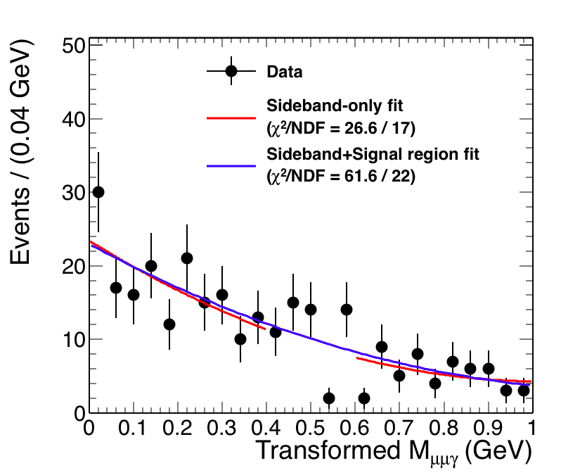

# Sideband-Fit Study #

During the review of SMP-17-012 analysis, there are several questions regarding the background method, especially for the non-resonant background.
The estimation is as follows: 

1. Treat all the selected events in data as non-resonant background events.
2. A function is chosen to fit m&mu;&mu;&gamma; distribution for the whole range. (How to choose the function is not introduce here.)
3. The resulting fit is used as non-resonant model in the limit setting procedure.

There are some issues,  

   * Before looking at the final results, one should perform so-called "blind" analysis. How this is done in the analysis?  
    
      * Ans: Do not plot the events in the blind region.

   * Why isn't the fit performed only in the sideband region, instead, in the whole range in the analysis?  

      * Our argument: The expected yield of the signal is very small. Whether excluding the signal region from the initial fit does not alter the resulting shape too much.

First of all, one should not mix the concepts of (1) "blind" analysis, and (2) the background model estimation from sideband region. The "blind" analysis is that the experimental results, in the signal (or searched) region defined beforehand, are hidden from the analyzers, until the analysis techniques are fixed and all analyzers agree that those used methods are appropriate. To estimate the background in the signal/searched region, one should always use the events in the sideband region(s), which is(are) also defined beforehand. Therefore in our case, the strategy to the background estimate is not correct at all.  

During the approval meeting, a study was suggested, to compare the shapes between the background-only fit and background-plus-signal fit in the full mass range. This study is valid given that the **background-plus-signal fit in the full mass range** is actually not too much different from **background-only components in sideband regions + signal component in signal region**, where the signal component takes care of the region, say, &plusmn;2&sigma;eff of the signal distribution (that is, the range containing ~95% of signal events).

2 Sets of studies are performed, one where the signal normalization is fixed to the 1&times; expected yield (left), while the other one (right) the signal normalization is allowed floating. (Here the results from H&rarr;J/&psi; &gamma; channel are shown.)

 

Based on the plots, both normalization scenarios do not result in huge differences with respect to the background-only fit, and hence the difference between the background model resulting from sideband region and that from the whole range is not significant at all.

------

## Implementation of the sideband-only fit ##

An attempt is made to do sideband-only fit in either ROOT or RooFit. 

### Binned fit using TF1 ###
An [example macro](https://root.cern.ch/root/html/tutorials/fit/fitExclude.C.html) (`fitExclude.C`) shows how an **binned** fit is performed to a histogram (TH1) excluding points in a given range.
The resulting plot is shown below.

The modified macro `fitExclude_TF1BinnedFit.C` applies the method on the H&rarr;J/&psi; &gamma; events.  Red  line shows the sideband-only fit, while  blue  line shows the fit in full mass range.
The used function is the Bernstein polynomial ([The class reference](https://root.cern.ch/doc/v608/classRooBernstein.html)), and the parametrization follows from this [source file (line 87~128)](https://root.cern.ch/doc/v608/RooBernstein_8cxx_source.html). The invariant masses are transformed such that they are in the range [0,1], where Bernstein basis polynomials are positive-definite. In this fit, a log likelihood method is used [1]. The &chi;2/NDF is also shown in the legend. As one can see, two fits are very similar.

[1]  [User guides : Fitting Histograms](https://root.cern.ch/root/htmldoc/guides/users-guide/FittingHistograms.html)

### Unbinned fit using TF1 ###
A tutorial showing how the unbinned maximum likelihood fit with ROOT::TF1 can be found [here](http://hep1.phys.ntu.edu.tw/~kfjack/lecture/hepstat/in3/inter-3.pdf). The macro in this tutorial is modified, and named as `example_06_modified.C` in this repository.

The implementation of unbinned maximum likelihood fit to sideband regions is not trivial, as described in this [forum post](https://sft.its.cern.ch/jira/browse/ROOT-8440).

